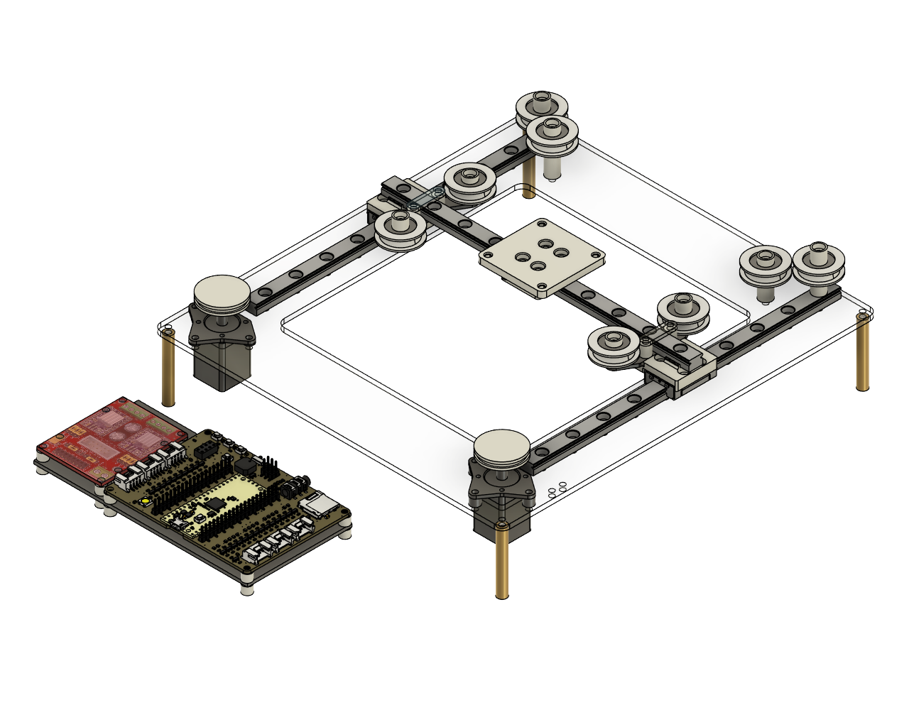
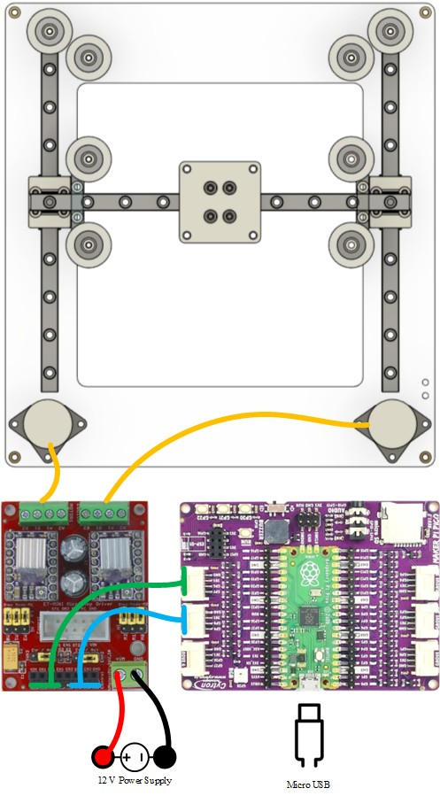

# CoreXY

This repository provides MicroPython firmware for controlling a CoreXY motion system using the Maker Pi Pico and two 20BYG101-02 stepper motors (NEMA 8, P = 4.4 W). The stepper motors are driven by the ET-MINI MicroStep Driver, ensuring precise and smooth motion control. The firmware includes stepper motor control logic for X and Y axis movement, optimized for 2D printing or CNC applications. It also supports adjustable microstepping and timing control for enhanced performance. The system is ideal for DIY 3D printers, robotic arms, or other applications requiring accurate motion control in embedded environments.

# Wiring diagram

# Example

The code for this example can be found [here](example/CoreXYDrive.py).

# Hardware details
* [CAD](hardware/coreXY.step)
* [ET-MINI MicroStep Driver](https://www.ett.co.th/prod2019/ET-MINI_MICRO_STEP/th-man-ET-Mini%20MicroStep%20Driver.pdf)
* [Maker Pi Pico](https://docs.google.com/document/d/1JoHsZk5IipQPCLXWbZYpDKjGlnkyACOJ1taUrKVsRg8/edit?tab=t.0)
* [Raspberry Pi Pico Datasheet](https://datasheets.raspberrypi.com/pico/pico-datasheet.pdf)
* [RP2040 Datasheet](https://datasheets.raspberrypi.com/rp2040/rp2040-datasheet.pdf) 
